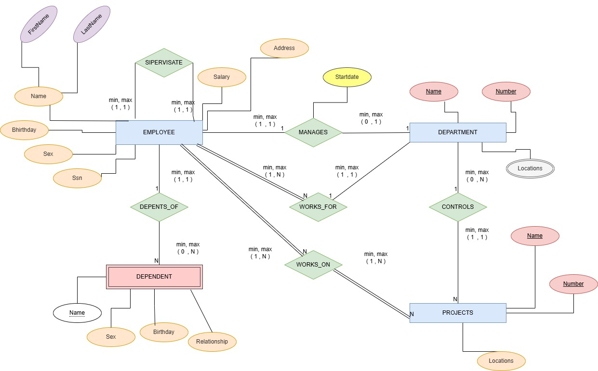
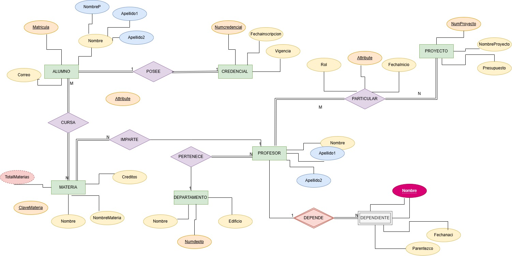

# Ejercicios del Modelo E-R

## Ejecicio 1.

Un hospital registra informacion de sus pacientes:
>De cada paciente que almacena: 
- numero d paciente que lo 
identifica 
- nombre
- Fecha de nacimiento 

> De cada expediente medico se almacena:
- Numero de expediente 
- Fecha de apertura
- Tipo de sangre

> Reglas del negocio
1. Cada paciente debe tener exactamente
un expediente medico
2. Cada expediente medico pertenece
a ununico paciente
3. No puede existir un expediente sin paciente
4. No puede exsistir un paciente sin expediente

> Que se dene realizar:
- Identificar laas entidades
- identificar atributos
- Dibujar las relaciones
- Determinar la cardinalidad
- Determinar la participacion de 
cada entidad

## Ejercicio 2
una Universidad administra profesores y cursos
> de cada profesor se almacena:
- numero de profesor (id)
- nombre
- especialidad

> de cada **curso** se almacena:

- Numero del curso
- Nombre del curso
- Creditos

> Reglas del negocio

1. Un profesor puede impartir varios cursos
2. Un curso solo puede ser impartido por un profesor
3. Puede existir un profesor que actualmente no imparta cursos
4. Todo curso debe estar asignado a un profesor

## Ejercicio 3 

Una escuela administra alumnos y materias 

> De cada **alumno** se almacena:

- Matricula
- Nombre
- Semestre

> De cada **Materia** se almacena: 

- Clave de la meteria 
- Nombre de la materia 
- Creditos

> Reglas del negocio 

1. Un alumno puede inscribirse en varias materias 
2. Una materia puede tener muchos alumnos inscritos
3. Puede esxistir una materia sin alumnos inscritos 
4. Todo alumno debe estar inscrito en al menos una materia
5. De cada inscripcion se desea almacenar:
 
 - Fecha de inscripcion
 - Calificacion final
 
nota: a la relacion nombrarla **INSCRIBE**

## Ejercicio 4
Una empresa dedicada a las ventas al por mayor necesita registrar lo siguiente:

> Para los clientes:
- numero de cliente
- nombre (el cual es una persona moral)

> pedidos

- Numero de pedido
- Fecha de pedido

> producto

- numero de producto
- nombre
- precio

> reglas del negocio

1. un cliente puede realizar muchos pedidos 
2. cada pedido pertenece a un cliente
3. un pedido contiene variios productos
4. Un producto puede aparecer en muchos pedidos
5. Un pedido debe contener al menos un producto
6. Un producto puede no haber sido vendido
7. El detalle del pedido no existe sin pedido
8. El detalle del pedido no existe sin producto
9. El detalle almacena la cantidad vendida y el precio de venta

## Ejercicio 5

1. The company is organized into departments. Each department has a unique name, a unique number, and a particular employee who manages the department.We keep track of the start date when that employee began managing the department. A department may have several locations.  

2. A department controls a number of projects, each of which has a unique name, a unique number, and a single location.

3. We store each employee's name, Social Security number, address, salary, sex (gender),and birth date. An employee is assigned to one department, but may work on several
projects, which are not necessarily controlled by the same department. We keep track of the current number of hours per week that an employee works on each project. We also keep track of the direct supervisor of each employee (who is another employee).

4. We want to keep track of the dependents of each employee for insurance purposes.We keep each dependent's first name, sex, birth date, and relationship to the employee.

## Ejercicio 6

