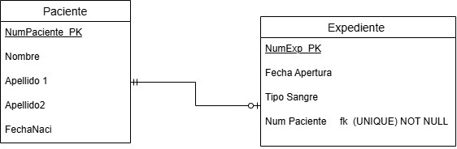

# Diccionario de datos de la base de datos control escolar

## Diccionario de Datos 1 de la Base de Datos Hospital

### 1. Información General

| Elemento | Valor |
| :--- | :--- |
| Proyecto | Sistema Clínico |
| Versión | 1.0 |
| Fecha | Junio 2026 |
| Elaboró | Ximena Miguel García |
| SGBD | SQL Server |

---

### 2. Descripción de la Base de Datos

La Base de Datos administra:

- Paciente
- Expediente

Permite almacenar la información de los pacientes y su expediente clínico.

---

### 3. Catálogo de Restricciones Utilizadas

| Catálogo | Significado |
| :--- | :--- |
| PK | Primary Key |
| FK | Foreign Key |
| NN | Not Null |
| UQ | Unique |
| AI | AutoIncrement o Identity |
| CK | Check |
| DF | Default |

---

### 4. Diccionario de Datos

### Tabla: Paciente

**Descripción**

Almacena la información general de los pacientes.

| Campo | Tipo | Longitud | Restricciones | Descripción |
| :--- | :--- | :--- | :--- | :--- |
| NumPaciente | INT | - | PK, AI, NN | Identificador del paciente |
| Nombre | VARCHAR | 50 | NN | Nombre del paciente |
| Apellido1 | VARCHAR | 50 | NN | Primer apellido |
| Apellido2 | VARCHAR | 50 | NULL | Segundo apellido |
| FechaNaci | DATE | - | NN | Fecha de nacimiento |

---

### Tabla: Expediente

**Descripción**

Almacena el expediente clínico de cada paciente.

| Campo | Tipo | Longitud | Restricciones | Descripción |
| :--- | :--- | :--- | :--- | :--- |
| NumExp | INT | - | PK, AI, NN | Identificador del expediente |
| FechaApertura | DATE | - | NN | Fecha de apertura |
| TipoSangre | VARCHAR | 5 | NN | Tipo de sangre |
| NumPaciente | INT | - | FK, UQ, NN | Paciente al que pertenece |

---

### 5. Relaciones en la Base de Datos

| Relación | Cardinalidad | Descripción |
| :--- | :--- | :--- |
| Paciente -> Expediente | 1:1 | Cada paciente posee un único expediente |

---

### 6. Matriz de Claves Foráneas

| Tabla | Campo FK | Referencia |
| :--- | :--- | :--- |
| Expediente | NumPaciente | Paciente(NumPaciente) |

---

### 7. Integridad Referencial

| Clave | Regla |
| :--- | :--- |
| IR-01 | No se puede registrar un expediente para un paciente inexistente. |

---

### 8. Reglas del Negocio

| Clave | Regla |
| :--- | :--- |
| RN-01 | Un paciente sólo puede tener un expediente. |
| RN-02 | Cada expediente pertenece a un único paciente. |

---

### 9. Diagrama Relacional

---
---