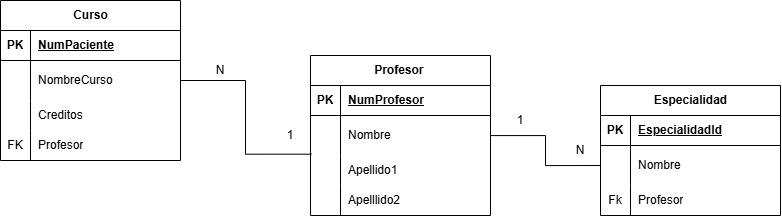

## Diccionario de Datos 2 de la Base de Datos Universidad

### 1. Información General

| Elemento | Valor |
| :--- | :--- |
| Proyecto | Sistema Escolar |
| Versión | 1.0 |
| Fecha | Junio 2026 |
| Elaboró | Ximena Miguel García |
| SGBD | SQL Server |

---

### 2. Descripción de la Base de Datos

La Base de Datos administra:

- Profesor
- Curso
- Especialidad

Permite administrar los cursos impartidos por los profesores y las especialidades que poseen.

---

### 3. Catálogo de Restricciones Utilizadas

| Catálogo | Significado |
| :--- | :--- |
| PK | Primary Key |
| FK | Foreign Key |
| NN | Not Null |
| UQ | Unique |
| AI | AutoIncrement o Identity |
| CK | Check |
| DF | Default |

---

### 4. Diccionario de Datos

### Tabla: Profesor

**Descripción**

Almacena la información de los profesores.

| Campo | Tipo | Longitud | Restricciones | Descripción |
| :--- | :--- | :--- | :--- | :--- |
| NumProfesor | INT | - | PK, AI, NN | Identificador del profesor |
| Nombre | VARCHAR | 50 | NN | Nombre |
| Apellido1 | VARCHAR | 50 | NN | Primer apellido |
| Apellido2 | VARCHAR | 50 | NULL | Segundo apellido |

---

### Tabla: Curso

**Descripción**

Almacena los cursos impartidos por los profesores.

| Campo | Tipo | Longitud | Restricciones | Descripción |
| :--- | :--- | :--- | :--- | :--- |
| NumCurso | INT | - | PK, AI, NN | Identificador del curso |
| NombreCurso | VARCHAR | 100 | NN | Nombre del curso |
| Creditos | INT | - | NN | Número de créditos |
| Profesor | INT | - | FK, NN | Profesor que imparte el curso |

---

### Tabla: Especialidad

**Descripción**

Almacena las especialidades de cada profesor.

| Campo | Tipo | Longitud | Restricciones | Descripción |
| :--- | :--- | :--- | :--- | :--- |
| EspecialidadID | INT | - | PK, AI, NN | Identificador |
| Nombre | VARCHAR | 100 | NN | Nombre de la especialidad |
| Profesor | INT | - | FK, NN | Profesor asignado |

---

### 5. Relaciones en la Base de Datos

| Relación | Cardinalidad | Descripción |
| :--- | :--- | :--- |
| Profesor -> Curso | 1:N | Un profesor puede impartir varios cursos |
| Profesor -> Especialidad | 1:N | Un profesor puede tener varias especialidades |

---

### 6. Matriz de Claves Foráneas

| Tabla | Campo FK | Referencia |
| :--- | :--- | :--- |
| Curso | Profesor | Profesor(NumProfesor) |
| Especialidad | Profesor | Profesor(NumProfesor) |

---

### 7. Integridad Referencial

| Clave | Regla |
| :--- | :--- |
| IR-01 | No puede existir un curso sin profesor. |
| IR-02 | No puede existir una especialidad sin profesor. |

---

### 8. Reglas del Negocio

| Clave | Regla |
| :--- | :--- |
| RN-01 | Un profesor puede impartir varios cursos. |
| RN-02 | Cada curso pertenece a un solo profesor. |
| RN-03 | Un profesor puede tener varias especialidades. |

---

### 9. Diagrama Relacional

---
---