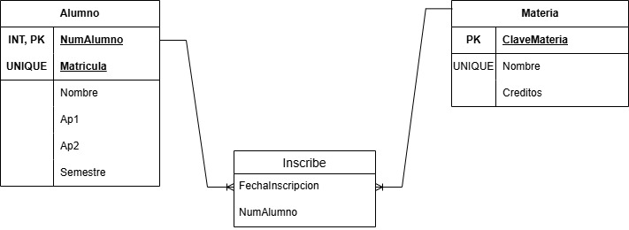

## Diccionario de base de datos 3 

1. Informacion General

| Elemento  | Valor |
| :--- | :--- |
| Proyecto | Control escolar |
| Version | 1.0|
| Fecha | Junio 2026|
| Elaboro | Ximena Miguel García | 
| SGBD | SQLSERVER |

2. Descripcion de la base de datos

La base de datos administra:
- Carrera 
- Alumno
- Profesor 
- Materia
- Grupo
- Inscripcion

Permite controlar la oferta educativa y la inscripcion de estudiantes

3. Catalogo de Restrincciones Utilizadas 

| Catalogo | significado |
| :--- | :--- |
| PK | Primary Key |
| FK | Foreing Key|
| NN | Not Null |
| UQ | Unique |
| AI | Autoincrement o indentity |
| CK | Check|
| DF | Default|

4. Diccionario de Datos 

**Tabla:** _Correo_

**Descripcion**
Almacena las carreras ofertadas por la universidad

| Campo | Tipo | Longitud | Restrticciones | Descripcion |
| :--- | :--- | :--- | :--- | :--- |
| ID_Carrera | INT | - | PK, AI, NN | Identificador Unico de la carrera |
| nombre | VARCHAR | 100 | UQ, NN | Nombre de la carrera |
| duracio_cuatrimestre | INT | 100 | CK (>0), NN | Duracion de cuatrimestre |

---

**Tabla:** _Alumno_

**Descripcion**
Almacena la informcaion de los estudiantes

| Campo | Tipo | Longitud | Restrticciones | Descripcion |
| :--- | :--- | :--- | :--- | :--- |
| Id_Alumno | INT | - | PK, AI, NN | Identificador del alumno|
| matricula | VARCHAR | 10 | UQ, NN | Matricula Institucional del alumno |
| nombre | VARCHAR | 50 | NN | Nombre del alumno |
| apellido_paterno | VARCHAR | 50 | NN | Apelido Paterno |
| apellido_materno | VARCHAR | 50 | UQ, NULL | Apellido Materno |
| correo | VARCHAR | 100 | UQ, NULL | Correo instituional |
| fecha_nacimiento | DATE | - | NN | Fecha nacimiento |
| id_carrera | INT | - | FK, NN | Carrera a la que pertenece |

---

TODO: Documentar las siguientes tablas

5. Relaciones en la base de datos

| Relacion | Cardinalidad | Descripcion |
| :--- | :--- | :--- | 
| Carrera --> Alumno | 1:N | Una carrera tiene muchos alumnos  |
| Carrera --> Materia | 1:N | Una carrera tiene muchas materias | 
| Profesor --> Grupo | 1:N | Un profesor puede impartir varios grupos |
| Materia --> Grupo | 1:N | Una materia puede abrirse en varios grupos |
| Alumno --> Inscripcion | 1:N | Un alumno puede tener varias inscripciones |
| Grupo --> Inscripcion | 1:N | Un grupo puede tener muchos alumnos |

6. Matriz de claves foraneas

| Tabla | Campo FK | Referencia |
| :--- | :--- | :--- | 
| Alumno | id_carrera | Carrera(id_carrera) | 
| Materia |id_carrera | Carrera(id_carrera) | 
| Grupo | id_profesor | Profesor(id_profesor) | 
| Grupo | id_materia | Materia(id_materia) | 
| Inscripcion | id_alumno | Alumno(id_alumno) | 
| Incripcion | id_grupo | Grupo(id_grupo) | 

7. Integridad Referencial 

| Clave | Regla |
| :--- | :--- |
| IR-01 | No se puede registrar un alumno con una carrera inexistente |
| IR-02 | No se puede crear un grupo para una materia inexistente |
| IR-03 | No se puede crear un grupo para un profesor inexistente |

8. Reglas del negocio

| Clave | Regla |
| :--- | :--- |
| RN-01 | Un alumno pertenece a una sola carrera |
| RN-02 | Una materia puede tener muchos alumnos |
| RN-03 | Una carrera puede tener muchas materias |
| RN-04 | Un proofesor puede tener varios grupos |

9. Diagrama Relacional

---
---