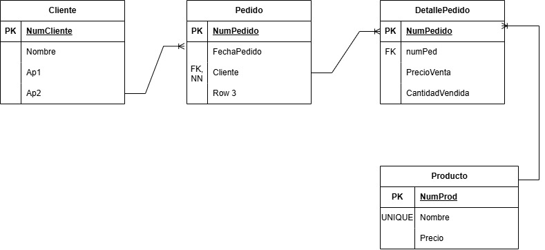

## Diccionario de Datos 4 de la Base de Datos Ventas

### 1. Información General

| Elemento | Valor |
| :--- | :--- |
| Proyecto | Sistema de Ventas |
| Versión | 1.0 |
| Fecha | Junio 2026 |
| Elaboró |  Ximena Miguel García |
| SGBD | SQL Server |

---

### 2. Descripción de la Base de Datos

La Base de Datos administra:

- Cliente
- Pedido
- Producto
- DetallePedido

Permite controlar las ventas realizadas por los clientes.

---

### 3. Catálogo de Restricciones Utilizadas

| Catálogo | Significado |
| :--- | :--- |
| PK | Primary Key |
| FK | Foreign Key |
| NN | Not Null |
| UQ | Unique |
| AI | AutoIncrement o Identity |
| CK | Check |
| DF | Default |

---

### 4. Diccionario de Datos

### Tabla: Cliente

**Descripción**

Almacena la información de los clientes.

| Campo | Tipo | Longitud | Restricciones | Descripción |
| :--- | :--- | :--- | :--- | :--- |
| NumCliente | INT | - | PK, AI, NN | Identificador del cliente |
| Nombre | VARCHAR | 50 | NN | Nombre |
| Ap1 | VARCHAR | 50 | NN | Primer apellido |
| Ap2 | VARCHAR | 50 | NULL | Segundo apellido |

---

### Tabla: Pedido

**Descripción**

Almacena los pedidos realizados por los clientes.

| Campo | Tipo | Longitud | Restricciones | Descripción |
| :--- | :--- | :--- | :--- | :--- |
| NumPedido | INT | - | PK, AI, NN | Identificador del pedido |
| FechaPedido | DATE | - | NN | Fecha del pedido |
| Cliente | INT | - | FK, NN | Cliente que realizó el pedido |
| Total | DECIMAL | 10,2 | NN | Total del pedido |

---

### Tabla: Producto

**Descripción**

Almacena los productos disponibles.

| Campo | Tipo | Longitud | Restricciones | Descripción |
| :--- | :--- | :--- | :--- | :--- |
| NumProd | INT | - | PK, AI, NN | Identificador del producto |
| Nombre | VARCHAR | 100 | UQ, NN | Nombre del producto |
| Precio | DECIMAL | 10,2 | NN | Precio del producto |

---

### Tabla: DetallePedido

**Descripción**

Almacena los productos incluidos en cada pedido.

| Campo | Tipo | Longitud | Restricciones | Descripción |
| :--- | :--- | :--- | :--- | :--- |
| NumDetalle | INT | - | PK, AI, NN | Identificador del detalle |
| NumPedido | INT | - | FK, NN | Pedido al que pertenece |
| NumProd | INT | - | FK, NN | Producto vendido |
| PrecioVenta | DECIMAL | 10,2 | NN | Precio de venta |
| CantidadVendida | INT | - | NN | Cantidad vendida |

---

### 5. Relaciones en la Base de Datos

| Relación | Cardinalidad | Descripción |
| :--- | :--- | :--- |
| Cliente -> Pedido | 1:N | Un cliente puede realizar varios pedidos |
| Pedido -> DetallePedido | 1:N | Un pedido puede tener varios productos |
| Producto -> DetallePedido | 1:N | Un producto puede aparecer en varios pedidos |

---

### 6. Matriz de Claves Foráneas

| Tabla | Campo FK | Referencia |
| :--- | :--- | :--- |
| Pedido | Cliente | Cliente(NumCliente) |
| DetallePedido | NumPedido | Pedido(NumPedido) |
| DetallePedido | NumProd | Producto(NumProd) |

---

### 7. Integridad Referencial

| Clave | Regla |
| :--- | :--- |
| IR-01 | No puede existir un pedido sin un cliente registrado. |
| IR-02 | No puede existir un detalle de pedido sin un pedido existente. |
| IR-03 | No puede venderse un producto inexistente. |

---

### 8. Reglas del Negocio

| Clave | Regla |
| :--- | :--- |
| RN-01 | Un cliente puede realizar múltiples pedidos. |
| RN-02 | Todo pedido debe pertenecer a un cliente. |
| RN-03 | Un pedido debe contener al menos un producto. |
| RN-04 | Un producto puede formar parte de varios pedidos. |

---

### 9. Diagrama Relacional

---
---