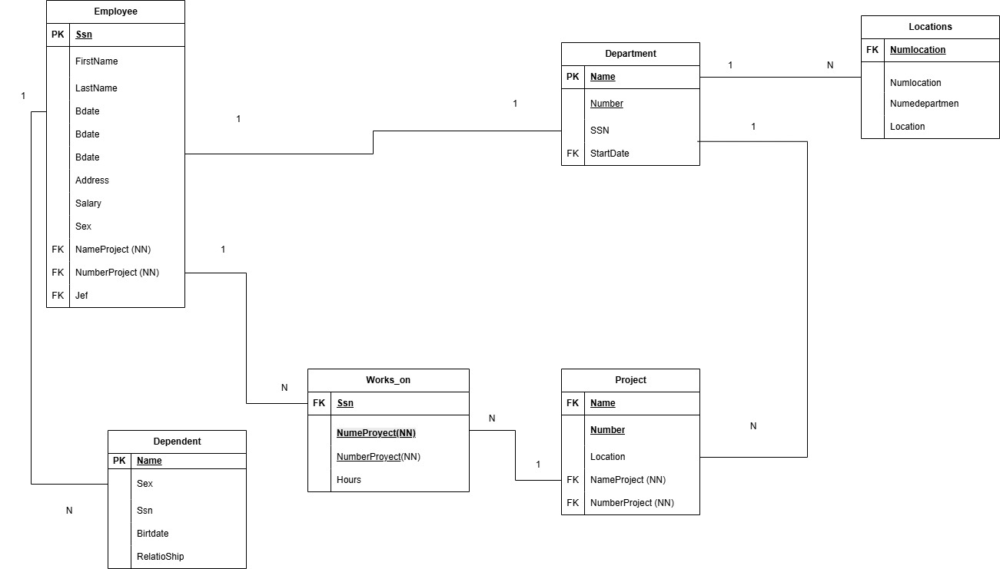

## Diccionario de Datos 5 de la Base de Datos Empresa

### 1. Información General

| Elemento | Valor |
| :--- | :--- |
| Proyecto | Sistema de Administración Empresarial |
| Versión | 1.0 |
| Fecha | Junio 2026 |
| Elaboró |  Ximena Miguel García |
| SGBD | SQL Server |

---

### 2. Descripción de la Base de Datos

La Base de Datos administra:

- Departamento
- Empleado
- Proyecto
- Trabaja_En
- Dependiente
- Ubicacion_Departamento

Permite administrar la información de los departamentos de la empresa, los empleados que pertenecen a cada uno de ellos, los proyectos desarrollados, las horas trabajadas por cada empleado, los dependientes registrados para efectos de seguros y las distintas ubicaciones de cada departamento.

---

### 3. Catálogo de Restricciones Utilizadas

| Catálogo | Significado |
| :--- | :--- |
| PK | Primary Key |
| FK | Foreign Key |
| NN | Not Null |
| UQ | Unique |
| AI | AutoIncrement o Identity |
| CK | Check |
| DF | Default |

---

### 4. Diccionario de Datos

### Tabla: Departamento

**Descripción**

Almacena la información de los departamentos de la empresa, incluyendo el gerente responsable y la fecha en que inició su administración.

| Campo | Tipo | Longitud | Restricciones | Descripción |
| :--- | :--- | :--- | :--- | :--- |
| num_departamento | INT | - | PK, NN | Número identificador del departamento. |
| nombre_departamento | VARCHAR | 100 | UQ, NN | Nombre único del departamento. |
| gerente_ssn | VARCHAR | 15 | FK, NN | Número de Seguro Social del gerente del departamento. |
| fecha_inicio_gerencia | DATE | - | NN | Fecha de inicio de la gerencia del departamento. |

---

### Tabla: Empleado

**Descripción**

Almacena la información personal y laboral de los empleados de la empresa.

| Campo | Tipo | Longitud | Restricciones | Descripción |
| :--- | :--- | :--- | :--- | :--- |
| ssn | VARCHAR | 15 | PK, NN | Número de Seguro Social del empleado. |
| nombre | VARCHAR | 100 | NN | Nombre completo del empleado. |
| direccion | VARCHAR | 200 | NN | Dirección del empleado. |
| salario | DECIMAL | 12,2 | NN, CK (>0) | Salario asignado al empleado. |
| sexo | CHAR | 1 | NN | Sexo del empleado. |
| fecha_nacimiento | DATE | - | NN | Fecha de nacimiento del empleado. |
| num_departamento | INT | - | FK, NN | Departamento al que pertenece el empleado. |
| supervisor_ssn | VARCHAR | 15 | FK, NULL | Número de Seguro Social del supervisor inmediato. |

---

### Tabla: Proyecto

**Descripción**

Almacena la información de los proyectos desarrollados dentro de la empresa.

| Campo | Tipo | Longitud | Restricciones | Descripción |
| :--- | :--- | :--- | :--- | :--- |
| num_proyecto | INT | - | PK, NN | Número identificador del proyecto. |
| nombre_proyecto | VARCHAR | 100 | UQ, NN | Nombre del proyecto. |
| ubicacion | VARCHAR | 100 | NN | Ubicación donde se desarrolla el proyecto. |
| num_departamento | INT | - | FK, NN | Departamento responsable del proyecto. |

---
### Tabla: Trabaja_En

**Descripción**

Almacena la información de la participación de los empleados en los proyectos de la empresa, indicando el número de horas trabajadas semanalmente.

| Campo | Tipo | Longitud | Restricciones | Descripción |
| :--- | :--- | :--- | :--- | :--- |
| ssn | VARCHAR | 15 | PK, FK, NN | Número de Seguro Social del empleado. |
| num_proyecto | INT | - | PK, FK, NN | Proyecto en el que trabaja el empleado. |
| horas_semana | DECIMAL | 5,2 | NN, CK (>=0) | Número de horas trabajadas por semana en el proyecto. |

---

### Tabla: Dependiente

**Descripción**

Almacena la información de los dependientes registrados por cada empleado para efectos administrativos y de seguros.

| Campo | Tipo | Longitud | Restricciones | Descripción |
| :--- | :--- | :--- | :--- | :--- |
| id_dependiente | INT | - | PK, AI, NN | Identificador único del dependiente. |
| nombre | VARCHAR | 100 | NN | Nombre completo del dependiente. |
| sexo | CHAR | 1 | NN | Sexo del dependiente. |
| fecha_nacimiento | DATE | - | NN | Fecha de nacimiento del dependiente. |
| parentesco | VARCHAR | 50 | NN | Relación del dependiente con el empleado. |
| ssn | VARCHAR | 15 | FK, NN | Número de Seguro Social del empleado al que pertenece el dependiente. |

---

### Tabla: Ubicacion_Departamento

**Descripción**

Almacena las diferentes ubicaciones físicas donde opera cada departamento de la empresa.

| Campo | Tipo | Longitud | Restricciones | Descripción |
| :--- | :--- | :--- | :--- | :--- |
| id_ubicacion | INT | - | PK, AI, NN | Identificador único de la ubicación. |
| num_departamento | INT | - | FK, NN | Departamento al que pertenece la ubicación. |
| ubicacion | VARCHAR | 100 | NN | Dirección o ubicación física del departamento. |

---
### 5. Relaciones en la Base de Datos

| Relación | Cardinalidad | Descripción |
| :--- | :--- | :--- |
| Departamento -> Empleado | 1:N | Un departamento puede tener varios empleados, pero cada empleado pertenece a un solo departamento. |
| Departamento -> Proyecto | 1:N | Un departamento administra uno o varios proyectos. |
| Empleado -> Trabaja_En | 1:N | Un empleado puede participar en varios proyectos. |
| Proyecto -> Trabaja_En | 1:N | Un proyecto puede tener asignados varios empleados. |
| Empleado -> Dependiente | 1:N | Un empleado puede registrar uno o varios dependientes. |
| Empleado -> Empleado | 1:N | Un empleado puede supervisar a otros empleados. |
| Departamento -> Ubicacion_Departamento | 1:N | Un departamento puede tener varias ubicaciones físicas. |

---

### 6. Matriz de Claves Foráneas

| Tabla | Campo FK | Referencia |
| :--- | :--- | :--- |
| Departamento | gerente_ssn | Empleado(ssn) |
| Empleado | num_departamento | Departamento(num_departamento) |
| Empleado | supervisor_ssn | Empleado(ssn) |
| Proyecto | num_departamento | Departamento(num_departamento) |
| Trabaja_En | ssn | Empleado(ssn) |
| Trabaja_En | num_proyecto | Proyecto(num_proyecto) |
| Dependiente | ssn | Empleado(ssn) |
| Ubicacion_Departamento | num_departamento | Departamento(num_departamento) |

---

### 7. Integridad Referencial

| Clave | Regla |
| :--- | :--- |
| IR-01 | No se puede registrar un empleado en un departamento inexistente. |
| IR-02 | Todo gerente debe ser un empleado registrado en la empresa. |
| IR-03 | No se puede asignar un proyecto a un departamento inexistente. |
| IR-04 | No se puede registrar la participación de un empleado en un proyecto inexistente. |
| IR-05 | No se puede registrar un dependiente para un empleado inexistente. |
| IR-06 | Todo supervisor debe existir previamente como empleado. |
| IR-07 | No se puede registrar una ubicación para un departamento inexistente. |
| IR-08 | No se puede eliminar un departamento mientras existan empleados o proyectos asociados. |
| IR-09 | No se puede eliminar un empleado si administra un departamento sin reasignar previamente un nuevo gerente. |
| IR-10 | No se puede eliminar un proyecto mientras existan empleados asignados en la tabla Trabaja_En. |

---

### 8. Reglas del Negocio

| Clave | Regla |
| :--- | :--- |
| RN-01 | Cada empleado pertenece a un único departamento. |
| RN-02 | Un departamento puede tener varios empleados. |
| RN-03 | Cada departamento debe contar con un gerente responsable. |
| RN-04 | Un gerente debe ser un empleado registrado en la empresa. |
| RN-05 | Un departamento puede administrar varios proyectos. |
| RN-06 | Cada proyecto pertenece únicamente a un departamento. |
| RN-07 | Un empleado puede trabajar en varios proyectos simultáneamente. |
| RN-08 | Un proyecto puede tener asignados varios empleados. |
| RN-09 | Debe registrarse el número de horas trabajadas por cada empleado en cada proyecto. |
| RN-10 | Un empleado puede supervisar a uno o varios empleados. |
| RN-11 | Un empleado puede tener varios dependientes registrados. |
| RN-12 | Un departamento puede contar con una o varias ubicaciones físicas. |
| RN-13 | El salario de un empleado debe ser mayor a cero. |
| RN-14 | Las horas trabajadas por semana deben ser mayores o iguales a cero. |
| RN-15 | La fecha de inicio de gerencia debe ser igual o posterior a la fecha de contratación del gerente (si ésta existe en el sistema). |

### 9. Diagrama Relacional

