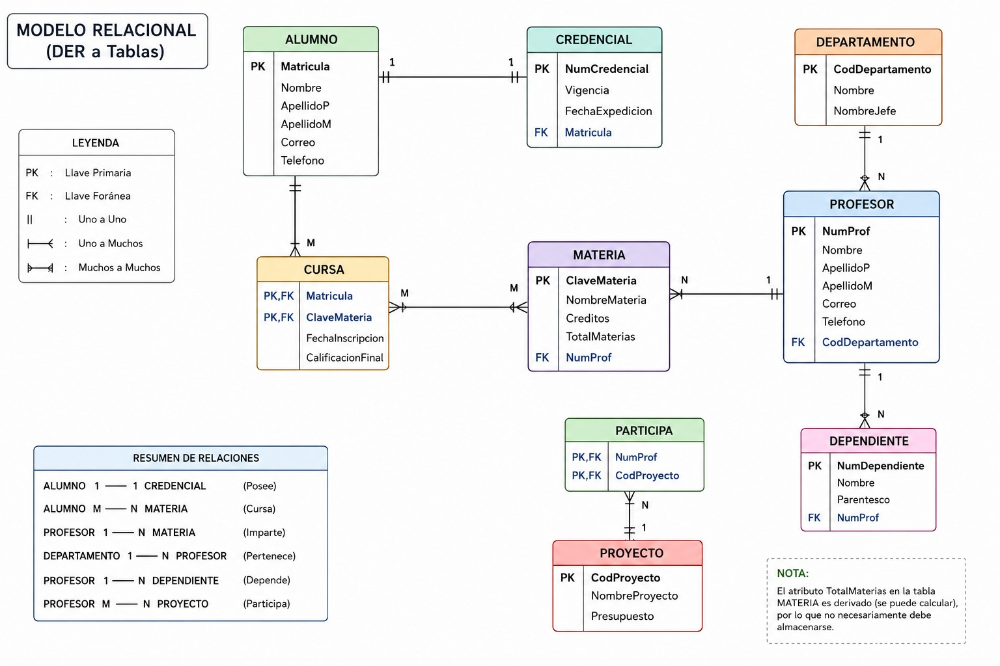

# Diccionario de Datos 6 de la Base de Datos Control Escolar

## 1. Información General

| Elemento | Valor |
| :--- | :--- |
| Proyecto | Control Escolar |
| Versión | 1.0 |
| Fecha | Junio 2026 |
| Elaboró |  Ximena Miguel García |
| SGBD | SQL Server |

---

### 2. Descripción de la Base de Datos

La Base de Datos administra la información relacionada con:

- Alumno
- Credencial
- Materia
- Profesor
- Departamento
- Dependiente
- Proyecto
- Cursa
- Participa

Permite controlar la información académica de los alumnos, la asignación de profesores a materias, la administración de departamentos, el registro de proyectos institucionales, así como el historial académico de cada estudiante.

---

### 3. Catálogo de Restricciones Utilizadas

| Catálogo | Significado |
| :--- | :--- |
| PK | Primary Key |
| FK | Foreign Key |
| NN | Not Null |
| UQ | Unique |
| AI | AutoIncrement o Identity |
| CK | Check |
| DF | Default |

---

### 4. Diccionario de Datos

### Tabla: Alumno

**Descripción**

Almacena la información personal y académica de los alumnos inscritos en la institución.

| Campo | Tipo | Longitud | Restricciones | Descripción |
| :--- | :--- | :--- | :--- | :--- |
| Matricula | VARCHAR | 10 | PK, NN | Matrícula única del alumno. |
| Nombre | VARCHAR | 50 | NN | Nombre(s) del alumno. |
| ApellidoP | VARCHAR | 50 | NN | Apellido paterno. |
| ApellidoM | VARCHAR | 50 | NN | Apellido materno. |
| Correo | VARCHAR | 100 | UQ, NN | Correo electrónico institucional. |
| Telefono | VARCHAR | 15 | NULL | Número telefónico del alumno. |

---

### Tabla: Credencial

**Descripción**

Almacena la información de las credenciales emitidas para cada alumno.

| Campo | Tipo | Longitud | Restricciones | Descripción |
| :--- | :--- | :--- | :--- | :--- |
| NumCredencial | INT | - | PK, AI, NN | Número identificador de la credencial. |
| Vigencia | DATE | - | NN | Fecha de vencimiento de la credencial. |
| FechaExpedicion | DATE | - | NN | Fecha de emisión de la credencial. |
| Matricula | VARCHAR | 10 | FK, UQ, NN | Alumno propietario de la credencial. |

---

### Tabla: Materia

**Descripción**

Almacena las materias ofertadas por la institución.

| Campo | Tipo | Longitud | Restricciones | Descripción |
| :--- | :--- | :--- | :--- | :--- |
| ClaveMateria | VARCHAR | 10 | PK, NN | Clave única de la materia. |
| NombreMateria | VARCHAR | 80 | NN | Nombre de la materia. |
| Creditos | INT | - | NN, CK (>0) | Número de créditos asignados. |
| TotalMaterias | INT | - | DF(0) | Cantidad total de materias registradas (atributo derivado). |
| NumProf | INT | - | FK, NN | Profesor responsable de impartir la materia. |

---

### Tabla: Profesor

**Descripción**

Almacena la información del personal docente de la institución.

| Campo | Tipo | Longitud | Restricciones | Descripción |
| :--- | :--- | :--- | :--- | :--- |
| NumProf | INT | - | PK, AI, NN | Identificador único del profesor. |
| Nombre | VARCHAR | 50 | NN | Nombre(s) del profesor. |
| ApellidoP | VARCHAR | 50 | NN | Apellido paterno. |
| ApellidoM | VARCHAR | 50 | NN | Apellido materno. |
| Correo | VARCHAR | 100 | UQ, NN | Correo institucional del profesor. |
| Telefono | VARCHAR | 15 | NULL | Número telefónico. |
| CodDepartamento | INT | - | FK, NN | Departamento al que pertenece. |
### Tabla: Departamento

**Descripción**

Almacena la información de los departamentos académicos de la institución, así como el responsable de cada uno de ellos.

| Campo | Tipo | Longitud | Restricciones | Descripción |
| :--- | :--- | :--- | :--- | :--- |
| CodDepartamento | INT | - | PK, AI, NN | Identificador único del departamento. |
| Nombre | VARCHAR | 80 | UQ, NN | Nombre del departamento. |
| NombreJefe | VARCHAR | 100 | NN | Nombre del jefe del departamento. |

---

### Tabla: Dependiente

**Descripción**

Almacena la información de los dependientes registrados por cada profesor.

| Campo | Tipo | Longitud | Restricciones | Descripción |
| :--- | :--- | :--- | :--- | :--- |
| NumDependiente | INT | - | PK, AI, NN | Identificador único del dependiente. |
| Nombre | VARCHAR | 100 | NN | Nombre completo del dependiente. |
| Parentesco | VARCHAR | 30 | NN | Relación familiar con el profesor. |
| NumProf | INT | - | FK, NN | Profesor al que pertenece el dependiente. |

---

### Tabla: Proyecto

**Descripción**

Almacena la información de los proyectos desarrollados dentro de la institución.

| Campo | Tipo | Longitud | Restricciones | Descripción |
| :--- | :--- | :--- | :--- | :--- |
| CodProyecto | INT | - | PK, AI, NN | Identificador único del proyecto. |
| NombreProyecto | VARCHAR | 100 | UQ, NN | Nombre del proyecto. |
| Presupuesto | DECIMAL | 12,2 | NN, CK (>0) | Presupuesto asignado al proyecto. |

---

### Tabla: Cursa

**Descripción**

Registra las materias inscritas por cada alumno, así como la fecha de inscripción y la calificación obtenida.

| Campo | Tipo | Longitud | Restricciones | Descripción |
| :--- | :--- | :--- | :--- | :--- |
| Matricula | VARCHAR | 10 | PK, FK, NN | Alumno inscrito. |
| ClaveMateria | VARCHAR | 10 | PK, FK, NN | Materia cursada. |
| FechaInscripcion | DATE | - | NN | Fecha en que el alumno se inscribió a la materia. |
| CalificacionFinal | DECIMAL | 4,2 | CK (>=0 y <=10) | Calificación final obtenida por el alumno. |

---

### Tabla: Participa

**Descripción**

Registra la participación de los profesores en los diferentes proyectos institucionales.

| Campo | Tipo | Longitud | Restricciones | Descripción |
| :--- | :--- | :--- | :--- | :--- |
| NumProf | INT | - | PK, FK, NN | Profesor participante. |
| CodProyecto | INT | - | PK, FK, NN | Proyecto en el que participa el profesor. |
---

### 5. Relaciones en la Base de Datos

| Relación | Cardinalidad | Descripción |
| :--- | :--- | :--- |
| Alumno -> Credencial | 1:1 | Cada alumno posee una única credencial institucional y cada credencial pertenece a un solo alumno. |
| Profesor -> Materia | 1:N | Un profesor puede impartir varias materias, pero cada materia es impartida por un solo profesor. |
| Departamento -> Profesor | 1:N | Un departamento puede tener varios profesores adscritos. |
| Profesor -> Dependiente | 1:N | Un profesor puede registrar uno o varios dependientes. |
| Alumno -> Cursa | 1:N | Un alumno puede cursar varias materias durante su trayectoria académica. |
| Materia -> Cursa | 1:N | Una materia puede ser cursada por varios alumnos. |
| Profesor -> Participa | 1:N | Un profesor puede participar en varios proyectos institucionales. |
| Proyecto -> Participa | 1:N | Un proyecto puede contar con la participación de varios profesores. |

---

### 6. Matriz de Claves Foráneas

| Tabla | Campo FK | Referencia |
| :--- | :--- | :--- |
| Credencial | Matricula | Alumno(Matricula) |
| Profesor | CodDepartamento | Departamento(CodDepartamento) |
| Materia | NumProf | Profesor(NumProf) |
| Dependiente | NumProf | Profesor(NumProf) |
| Cursa | Matricula | Alumno(Matricula) |
| Cursa | ClaveMateria | Materia(ClaveMateria) |
| Participa | NumProf | Profesor(NumProf) |
| Participa | CodProyecto | Proyecto(CodProyecto) |

---

### 7. Integridad Referencial

| Clave | Regla |
| :--- | :--- |
| IR-01 | No se puede registrar una credencial para un alumno inexistente. |
| IR-02 | No se puede registrar una materia sin un profesor asignado. |
| IR-03 | Todo profesor debe pertenecer a un departamento existente. |
| IR-04 | No se puede registrar un dependiente para un profesor inexistente. |
| IR-05 | No se puede inscribir un alumno en una materia inexistente. |
| IR-06 | No se puede registrar una inscripción para un alumno inexistente. |
| IR-07 | No se puede registrar la participación de un profesor inexistente en un proyecto. |
| IR-08 | No se puede registrar la participación en un proyecto inexistente. |
| IR-09 | No se puede eliminar un profesor si existen materias asignadas a él sin antes reasignarlas. |
| IR-10 | No se puede eliminar un alumno mientras tenga materias inscritas o una credencial activa. |

---

### 8. Reglas del Negocio

| Clave | Regla |
| :--- | :--- |
| RN-01 | Cada alumno debe contar con una matrícula única. |
| RN-02 | Cada alumno puede tener únicamente una credencial vigente. |
| RN-03 | Cada credencial pertenece exclusivamente a un alumno. |
| RN-04 | Un profesor puede impartir una o varias materias. |
| RN-05 | Cada materia debe ser impartida por un único profesor. |
| RN-06 | Todo profesor pertenece a un solo departamento. |
| RN-07 | Un departamento puede tener varios profesores adscritos. |
| RN-08 | Un profesor puede registrar varios dependientes. |
| RN-09 | Un alumno puede cursar varias materias durante un periodo escolar. |
| RN-10 | Una materia puede ser cursada por múltiples alumnos. |
| RN-11 | Un profesor puede participar en varios proyectos institucionales. |
| RN-12 | Un proyecto puede tener varios profesores participantes. |
| RN-13 | La calificación final debe encontrarse en un rango de 0 a 10. |
| RN-14 | El presupuesto de un proyecto debe ser mayor que cero. |
| RN-15 | Los créditos de una materia deben ser mayores que cero. |

---

### 9. Diagrama Relacional

