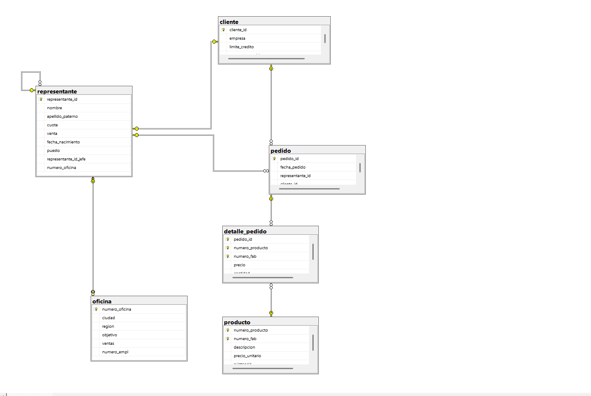

```SQL
CREATE DATABASE comercializadora;
GO
USE comercializadora;
-- TABLA PRODUCTO
CREATE TABLE producto (
	numero_producto CHAR (3) NOT NULL,
	numero_fab CHAR (5) NOT NULL,
	descripcion VARCHAR (50) NOT NULL,
	precio_unitario DECIMAL (10,2) NOT NULL,
	existencia INT NOT NULL ,
	CONSTRAINT  pk_producto 
	PRIMARY KEY (numero_producto,numero_fab),
	CONSTRAINT uq_producto_descripcion
	UNIQUE (descripcion),
	CONSTRAINT ck_producto_precio_unitario
	CHECK (precio_unitario >0.0),
	CONSTRAINT ck_producto_existencia
	CHECK (existencia BETWEEN 1  AND 1000)
);
GO
 -- TABLA OFICINA 
 CREATE TABLE oficina (
	numero_oficina INT NOT NULL IDENTITY (1,1),
	ciudad VARCHAR(30) NOT NULL,
	region VARCHAR (20),
	objetivo DECIMAL (10,2) NOT NULL,
	ventas DECIMAL (10,2) NOT NULL,
	numero_empl INT NOT NULL,
	CONSTRAINT  pk_oficina
	PRIMARY KEY (numero_oficina),
	CONSTRAINT ck_oficina_region
	CHECK (region IN ('Este','Oeste'))
 
 );
 GO

 /*======= Se agrego el constraint unique para el campo ciudad =====*/


 ALTER TABLE oficina
 ADD CONSTRAINT 
 uq_oficina_ciudad
 UNIQUE (ciudad);

  /*======= CREAR TABLA CLIENTE =======*/
 CREATE TABLE  cliente (
	cliente_id INT NOT NULL IDENTITY(1,1)
	CONSTRAINT pk_cliente
	PRIMARY KEY,
	empresa VARCHAR (30) NOT NULL
	CONSTRAINT uq_cliente_empresa
	UNIQUE,
	limite_credito DECIMAL (10,2) NOT NULL
	CONSTRAINT ck_cliente_limite_credito
	CHECK (limite_credito BETWEEN 100 AND 100000),
	representante_id INT NOT NULL
 
 );
 GO 

   /*======= CREAR TABLA REPRESENTANTE =======*/
CREATE TABLE representante (
	representante_id INT NOT NULL IDENTITY (1,1),
	nombre VARCHAR (20) NOT NULL,
	apellido_paterno VARCHAR (18)NULL,
	cuota DECIMAL (10,2) NOT NULL,
	venta DECIMAL (10,2),
	fecha_nacimiento DATE NOT NULL,
	puesto VARCHAR (30) NOT NULL,
	representante_id_jefe INT, -- Foreing Key recursiva o jerarquica 
	numero_oficina INT NOT NULL --Foreing Key de Oficina
	CONSTRAINT pk_representante
	PRIMARY KEY (representante_id),
	CONSTRAINT ck_representante_cuota
	CHECK (cuota >0.0),
	CONSTRAINT ck_representante_venta
	CHECK (venta >0.0),
	CONSTRAINT fk_representante_representante
	FOREIGN KEY (representante_id_jefe)
	REFERENCES representante (representante_id),
	CONSTRAINT fk_representante_oficina
	FOREIGN KEY (numero_oficina)
	REFERENCES oficina (numero_oficina)

);
GO
 
    /*======= CREAR TABLA PEDIDO   =======*/

 CREATE TABLE pedido (
	pedido_id INT NOT NULL IDENTITY (1,1)
	CONSTRAINT pk_pedido
	PRIMARY KEY (pedido_id),
	fecha_pedido DATETIME2 NOT NULL
	CONSTRAINT df_fecha_pedido
	DEFAULT SYSDATETIME(), /*FECHA DEL DOCKER EN DONDE ESTA EL SGBM */
	representante_id INT NOT NULL
	CONSTRAINT  fk_pedido_representante
	FOREIGN KEY (representante_id)
	REFERENCES representante(representante_id),
	cliente_id INT NOT NULL
	CONSTRAINT fk_pedido_cliente
	FOREIGN KEY (cliente_id)
	REFERENCES cliente(cliente_id)
 
 );
 GO

     /*======= CREAR TABLA DETALLE PEDIDO   =======*/
CREATE TABLE detalle_pedido(
	pedido_id  INT NOT NULL,
	numero_producto CHAR (3) NOT NULL,
	numero_fab CHAR (5) NOT NULL,
	precio DECIMAL (10,2)NOT NULL,
	CONSTRAINT ck_detalle_pedido_precio
	CHECK(precio>0.0),
	cantidad INT NOT NULL
	CONSTRAINT ck_detalle_pedido_cantidad
	CHECK (cantidad>0),
	CONSTRAINT pk_detalle_pedido
	PRIMARY KEY (pedido_id,numero_producto ,numero_fab),
	CONSTRAINT fk_detalle_pedido_pedido
	FOREIGN KEY (pedido_id)
	REFERENCES pedido(pedido_id),
	CONSTRAINT fk_detalle_pedido_producto
	FOREIGN KEY (numero_producto,numero_fab)
	REFERENCES producto (numero_producto, numero_fab)
);
GO

     /*======= CREAR LAS FOREIGN KEY DE OFICINA CON REPRESENTANTE  =======*/


 ALTER TABLE oficina
 ADD CONSTRAINT fk_oficina_representante
 FOREIGN KEY (numero_empl)
 REFERENCES representante (representante_id);

     /*======= CREAR LAS FOREIGN KEY DE OFICINA CON REPRESENTANTE  =======*/


	 ALTER TABLE cliente 
	 ADD CONSTRAINT fk_cliente_representante
	 FOREIGN KEY (representante_id)
	 REFERENCES representante(representante_id);
	 GO
     ```
     
