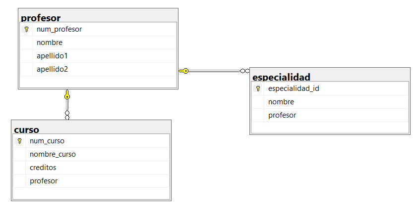

```SQL
/* ============================================================================
   EJERCICIO 2 - CURSO
   ============================================================================ */
   CREATE DATABASE ejercicio2_curso;
GO
USE ejercicio2_curso;
GO
   CREATE TABLE profesor (
    num_profesor  INT NOT NULL IDENTITY(1,1),
    nombre        VARCHAR(30) NOT NULL,
    apellido1     VARCHAR(20) NOT NULL,
    apellido2     VARCHAR(20) NULL,
    CONSTRAINT pk_profesor
        PRIMARY KEY (num_profesor)
);
GO


CREATE TABLE curso (
    num_curso     INT NOT NULL IDENTITY(1,1),
    nombre_curso  VARCHAR(50) NOT NULL,
    creditos      INT NOT NULL,
    profesor      INT NOT NULL,
    CONSTRAINT pk_curso
        PRIMARY KEY (num_curso),
    CONSTRAINT fk_curso_profesor
        FOREIGN KEY (profesor)
        REFERENCES profesor (num_profesor)
);
GO


CREATE TABLE especialidad (
    especialidad_id  INT NOT NULL IDENTITY(1,1),
    nombre           VARCHAR(30) NOT NULL,
    profesor         INT NOT NULL,
    CONSTRAINT pk_especialidad
        PRIMARY KEY (especialidad_id),
    CONSTRAINT fk_especialidad_profesor
        FOREIGN KEY (profesor)
        REFERENCES profesor (num_profesor)
);
GO


```


