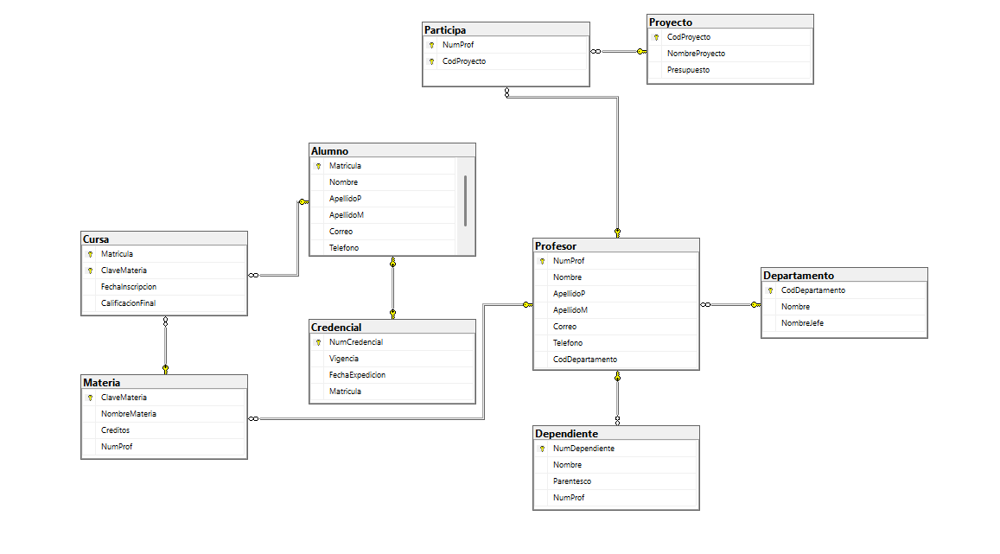

```SQL
/* ============================================================================
   EJERCICIO 6 - CREDENCIAL (Alumno, Credencial, Departamento, Profesor,
   Materia, Cursa, Dependiente, Proyecto, Participa)
   ============================================================================ */
CREATE DATABASE ejercicio6_credencial;
GO
USE ejercicio6_credencial;
GO

-- Tabla: Alumno
CREATE TABLE Alumno (
    Matricula   VARCHAR(15)     NOT NULL,
    Nombre      VARCHAR(30)     NOT NULL,
    ApellidoP   VARCHAR(20)     NOT NULL,
    ApellidoM   VARCHAR(20)     NULL,
    Correo      VARCHAR(50)     NULL,
    Telefono    VARCHAR(15)     NULL,
    CONSTRAINT PK_Alumno
        PRIMARY KEY (Matricula)
);
GO

-- Tabla: Departamento
CREATE TABLE Departamento (
    CodDepartamento INT            NOT NULL IDENTITY(1,1),
    Nombre          VARCHAR(30)    NOT NULL,
    NombreJefe      VARCHAR(30)    NULL,
    CONSTRAINT PK_Departamento
        PRIMARY KEY (CodDepartamento)
);
GO

-- Tabla: Credencial 
CREATE TABLE Credencial (
    NumCredencial     INT           NOT NULL IDENTITY(1,1),
    Vigencia          DATE          NOT NULL,
    FechaExpedicion   DATE          NOT NULL,
    Matricula         VARCHAR(15)   NOT NULL,   -- FK -> Alumno.Matricula
    CONSTRAINT PK_Credencial
        PRIMARY KEY (NumCredencial),
    CONSTRAINT UQ_Credencial_Matricula
        UNIQUE (Matricula),
    CONSTRAINT FK_Credencial_Alumno
        FOREIGN KEY (Matricula)
        REFERENCES Alumno (Matricula)
);
GO

-- Tabla: Profesor (N Profesor : 1 Departamento)
CREATE TABLE Profesor (
    NumProf          INT            NOT NULL IDENTITY(1,1),
    Nombre           VARCHAR(30)    NOT NULL,
    ApellidoP        VARCHAR(20)    NOT NULL,
    ApellidoM        VARCHAR(20)    NULL,
    Correo           VARCHAR(50)    NULL,
    Telefono         VARCHAR(15)    NULL,
    CodDepartamento  INT            NOT NULL,  -- FK -> Departamento.CodDepartamento
    CONSTRAINT PK_Profesor
        PRIMARY KEY (NumProf),
    CONSTRAINT FK_Profesor_Departamento
        FOREIGN KEY (CodDepartamento)
        REFERENCES Departamento (CodDepartamento)
);
GO

-- Tabla: Materia (1 Profesor : N Materia)
-- NOTA: TotalMaterias es un atributo derivado (se calcula con COUNT en la
-- consulta), no se agrega como columna fisica, tal como indica la nota
-- del diagrama.
CREATE TABLE Materia (
    ClaveMateria    CHAR(5)         NOT NULL,
    NombreMateria   VARCHAR(50)     NOT NULL,
    Creditos        INT             NOT NULL,
    NumProf         INT             NOT NULL,  -- FK -> Profesor.NumProf
    CONSTRAINT PK_Materia
        PRIMARY KEY (ClaveMateria),
    CONSTRAINT FK_Materia_Profesor
        FOREIGN KEY (NumProf)
        REFERENCES Profesor (NumProf)
);
GO

-- Tabla: Cursa (M:N Alumno-Materia)
CREATE TABLE Cursa (
    Matricula           VARCHAR(15)     NOT NULL,
    ClaveMateria        CHAR(5)         NOT NULL,
    FechaInscripcion    DATE            NOT NULL,
    CalificacionFinal   DECIMAL(4,2)    NULL,
    CONSTRAINT PK_Cursa
        PRIMARY KEY (Matricula, ClaveMateria),
    CONSTRAINT FK_Cursa_Alumno
        FOREIGN KEY (Matricula)
        REFERENCES Alumno (Matricula),
    CONSTRAINT FK_Cursa_Materia
        FOREIGN KEY (ClaveMateria)
        REFERENCES Materia (ClaveMateria)
);
GO

-- Tabla: Dependiente 
CREATE TABLE Dependiente (
    NumDependiente  INT             NOT NULL IDENTITY(1,1),
    Nombre          VARCHAR(30)     NOT NULL,
    Parentesco      VARCHAR(20)     NULL,
    NumProf         INT             NOT NULL,  -- FK -> Profesor.NumProf
    CONSTRAINT PK_Dependiente
        PRIMARY KEY (NumDependiente),
    CONSTRAINT FK_Dependiente_Profesor
        FOREIGN KEY (NumProf)
        REFERENCES Profesor (NumProf)
);
GO

-- Tabla: Proyecto
CREATE TABLE Proyecto (
    CodProyecto     INT             NOT NULL IDENTITY(1,1),
    NombreProyecto  VARCHAR(50)     NOT NULL,
    Presupuesto     DECIMAL(12,2)   NOT NULL,
    CONSTRAINT PK_Proyecto
        PRIMARY KEY (CodProyecto)
);
GO

-- Tabla: Participa 
CREATE TABLE Participa (
    NumProf     INT     NOT NULL,
    CodProyecto INT     NOT NULL,
    CONSTRAINT PK_Participa
        PRIMARY KEY (NumProf, CodProyecto),
    CONSTRAINT FK_Participa_Profesor
        FOREIGN KEY (NumProf)
        REFERENCES Profesor (NumProf),
    CONSTRAINT FK_Participa_Proyecto
        FOREIGN KEY (CodProyecto)
        REFERENCES Proyecto (CodProyecto)
);
GO

```

