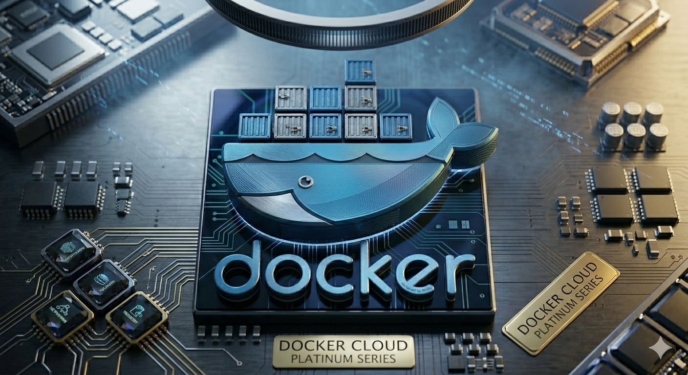

# Documentacion de Contenedores Docker de Sistemas Gestores de Base de Datos
## contenedor de tutorial de Docker
docker pull postgres:14.22-trixie
docker pull docker/getting-started
docker run -d -p 80:80 docker/getting-started

- -d detach (El proceso del contenedor se ejecuta en background)
- -p (port,publish) (Mapea el puerto)
-  docker/getting-started (Nombre de la imagen)

## Contenedor del DBMS MariaBD
docker pull mariadb:lts-ubi9
## Contenedor  de MariaDB sin volumen
docker run --name ServerMariaDBG2 -e MARIADB_ROOT_PASSWORD=123456 \
-d  -p 3345:3306 e0236f

## Comandos docker 
| Comando   | Descripcion |
|-----------|-----------|
| docker pull nombre_imagen| **Descarga una imagen de dockerHub** [Docker Hub] (https://hub.docker.com/)   |
| Docker images | **Visualizar las imagenes que se encuentrar en docker**|
|docker ps| **Visualiza todos los contenedores que estan ensendidos** |
|docker ps -a | **Vizualizar todos los contenedores que estan encendidos y apagados** |
|docker stop idcontenedor o nombrecontenedor | **Detiene un contenedor** |

|docker rm idcontenedor o nombrecontenedor | **Elimina un contenedor** |
|docker rm -f idcontenedor o nombrecontenedor | **Elimina un contenedor este o no encendido** |
## Contenedor de mariadb con volumen 
docker run --name ServerMariaDBG2 -e MARIADB_ROOT_PASSWORD=123456 \
-d  -v v-mariadbG2:/var/lib/mysql -p 3345:3306 e0236f
## Contenedor  de postgres conn volumen 
docker run --name ServerPostgresG2 -ePOSTGRES_PASSWORD=123456 \
-d -p 5457:5432 -v v-postgresg2:/var/lib/postgresql/data \
eba8dd

# Contenedor de SQLServer 2022 con volumen 
docker run -e "ACCEPT_EULA=Y" -e "MSSQL_SA_PASSWORD=P@ssw0rd" \
   -u 0 \
   -p 1452:1433 --name SQLServerG2 \
   -d -v vol-sqlserverg2:/var/opt/mssql/data \
   e07b969
